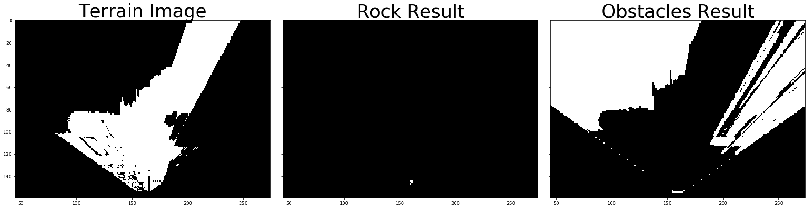

## Project: Search and Sample Return
### Writeup Template: You can use this file as a template for your writeup if you want to submit it as a markdown file, but feel free to use some other method and submit a pdf if you prefer.

---


**The goals / steps of this project are the following:**  

**Training / Calibration**  

* Download the simulator and take data in "Training Mode"
* Test out the functions in the Jupyter Notebook provided
* Add functions to detect obstacles and samples of interest (golden rocks)
* Fill in the `process_image()` function with the appropriate image processing steps (perspective transform, color threshold etc.) to get from raw images to a map.  The `output_image` you create in this step should demonstrate that your mapping pipeline works.
* Use `moviepy` to process the images in your saved dataset with the `process_image()` function.  Include the video you produce as part of your submission.

**Autonomous Navigation / Mapping**

* Fill in the `perception_step()` function within the `perception.py` script with the appropriate image processing functions to create a map and update `Rover()` data (similar to what you did with `process_image()` in the notebook). 
* Fill in the `decision_step()` function within the `decision.py` script with conditional statements that take into consideration the outputs of the `perception_step()` in deciding how to issue throttle, brake and steering commands. 
* Iterate on your perception and decision function until your rover does a reasonable (need to define metric) job of navigating and mapping.  

[//]: # "Image References"

[image1]: ./misc/rover_image.jpg
[image2]: ./calibration_images/example_grid1.jpg
[image3]: ./calibration_images/example_rock1.jpg

## [Rubric](https://review.udacity.com/#!/rubrics/916/view) Points
### Here I will consider the rubric points individually and describe how I addressed each point in my implementation.  

---
### Writeup / README

#### 1. Provide a Writeup / README that includes all the rubric points and how you addressed each one.  You can submit your writeup as markdown or pdf.  

You're reading it!

### Notebook Analysis
#### 1. Run the functions provided in the notebook on test images (first with the test data provided, next on data you have recorded). Add/modify functions to allow for color selection of obstacles and rock samples.
- Threshold

  ```python
  def color_thresh(img, rgb_thresh=(160, 160, 160), rgb_thresh_max=(255, 255, 255)):
      # Create an array of zeros same xy size as img, but single channel
      color_select = np.zeros_like(img[:,:,0])
      # Require that each pixel be above all three threshold values in RGB
      # above_thresh will now contain a boolean array with "True"
      # where threshold was met
      thresh_select = (img[:,:,0] > rgb_thresh[0]) \
                  & (img[:,:,1] > rgb_thresh[1]) \
                  & (img[:,:,2] > rgb_thresh[2]) \
                  & (img[:,:,0] < rgb_thresh_max[0]) \
                  & (img[:,:,1] < rgb_thresh_max[1]) \
                  & (img[:,:,2] < rgb_thresh_max[2]) 

      # Index the array of zeros with the boolean array and set to 1
      color_select[thresh_select] = 1
      # Return the binary image
      return color_select

  rgb_threshold=(170, 170, 170)
  threshed = color_thresh(warped, rgb_threshold)
  #scipy.misc.imsave('../output/warped_threshed.jpg', threshed*255)
     

  def color_thresh_rock(img, hsv_thresh_lower=(30, 100, 100), hsv_thresh_upper=(30, 255, 255)):
      color_select = np.zeros_like(img[:,:,0])

      hsv = cv2.cvtColor(img, cv2.COLOR_BGR2HSV)

      lower_gold = np.array([hsv_thresh_lower[0], hsv_thresh_lower[1], hsv_thresh_lower[2]])
      upper_gold = np.array([hsv_thresh_upper[0], hsv_thresh_upper[1], hsv_thresh_upper[2]])

      mask = cv2.inRange(hsv, lower_gold, upper_gold)
      res = cv2.bitwise_and(img,img, mask= mask)
      color_select[mask] = 1

      return color_select
  ```

  


#### 2. Populate the `process_image()` function with the appropriate analysis steps to map pixels identifying navigable terrain, obstacles and rock samples into a worldmap.  Run `process_image()` on your test data using the `moviepy` functions provided to create video output of your result. 
- Coordination Transformation

  ```python
  def rover_coords(binary_img):
      # Identify nonzero pixels
      ypos, xpos = binary_img.nonzero()
      # Calculate pixel positions with reference to the rover position being at the 
      # center bottom of the image.  
      x_pixel = -(ypos - binary_img.shape[0]).astype(np.float)
      y_pixel = -(xpos - binary_img.shape[1]/2 ).astype(np.float)
      return x_pixel, y_pixel

  # Define a function to convert to radial coords in rover space
  def to_polar_coords(x_pixel, y_pixel):
      # Convert (x_pixel, y_pixel) to (distance, angle) 
      # in polar coordinates in rover space
      # Calculate distance to each pixel
      dist = np.sqrt(x_pixel**2 + y_pixel**2)
      # Calculate angle away from vertical for each pixel
      angles = np.arctan2(y_pixel, x_pixel)
      return dist, angles

  # Define a function to map rover space pixels to world space
  def rotate_pix(xpix, ypix, yaw):
      # Convert yaw to radians
      yaw_rad = yaw * np.pi / 180
      xpix_rotated = (xpix * np.cos(yaw_rad)) - (ypix * np.sin(yaw_rad))
                              
      ypix_rotated = (xpix * np.sin(yaw_rad)) + (ypix * np.cos(yaw_rad))
      # Return the result  
      return xpix_rotated, ypix_rotated

  def translate_pix(xpix_rot, ypix_rot, xpos, ypos, scale): 
      # Apply a scaling and a translation
      xpix_translated = (xpix_rot / scale) + xpos
      ypix_translated = (ypix_rot / scale) + ypos
      # Return the result  
      return xpix_translated, ypix_translated


  # Define a function to apply rotation and translation (and clipping)
  # Once you define the two functions above this function should work
  def pix_to_world(xpix, ypix, xpos, ypos, yaw, world_size, scale):
      # Apply rotation
      xpix_rot, ypix_rot = rotate_pix(xpix, ypix, yaw)
      # Apply translation
      xpix_tran, ypix_tran = translate_pix(xpix_rot, ypix_rot, xpos, ypos, scale)
      # Perform rotation, translation and clipping all at once
      x_pix_world = np.clip(np.int_(xpix_tran), 0, world_size - 1)
      y_pix_world = np.clip(np.int_(ypix_tran), 0, world_size - 1)
      # Return the result
      return x_pix_world, y_pix_world
  ```

- Calculate the proper direction

  ```python
  xpix, ypix = rover_coords(threshed)
  dist, angles = to_polar_coords(xpix, ypix)
  mean_dir = np.mean(angles)
  ```

  ​

### Autonomous Navigation and Mapping

#### 1. Fill in the `perception_step()` (at the bottom of the `perception.py` script) and `decision_step()` (in `decision.py`) functions in the autonomous mapping scripts and an explanation is provided in the writeup of how and why these functions were modified as they were.

- Two thresh related code for terrain, rock and obstacles.

  - ` color_thresh` with upper and lower bound for terrain and obstacles
  - `color_thresh_rock` with HSV for rock detection

- Show current image threshold result. The pixel is multiplied by 255 to show the current correctly.

  ```python
  Rover.vision_image[:,:,0] = threshedObs * 255
  Rover.vision_image[:,:,1] = threshedRock * 255
  Rover.vision_image[:,:,2] = threshed * 255
  ```

- With small pitch and roll, we can build the map correctly.

  ```python
  if (Rover.pitch < 0.5) and (Rover.roll < 0.5):
          Rover.worldmap[obstacle_y_world, obstacle_x_world, 0] += 1
          Rover.worldmap[rock_y_world, rock_x_world, 1] += 1
          Rover.worldmap[navigable_y_world, navigable_x_world, 2] += 1 
  ```


#### 2. Launching in autonomous mode your rover can navigate and map autonomously.  Explain your results and how you might improve them in your writeup.  

The most confused problem is to design an algorithms that will move the robot smoothly  when it is stuck on a rock. Sometimes it jumped up suddenly and I have no idea about the reason, which seems to be the simulator error or bias.


#### Simulator Setting

-  1024 * 768
- Good
- FPS 60